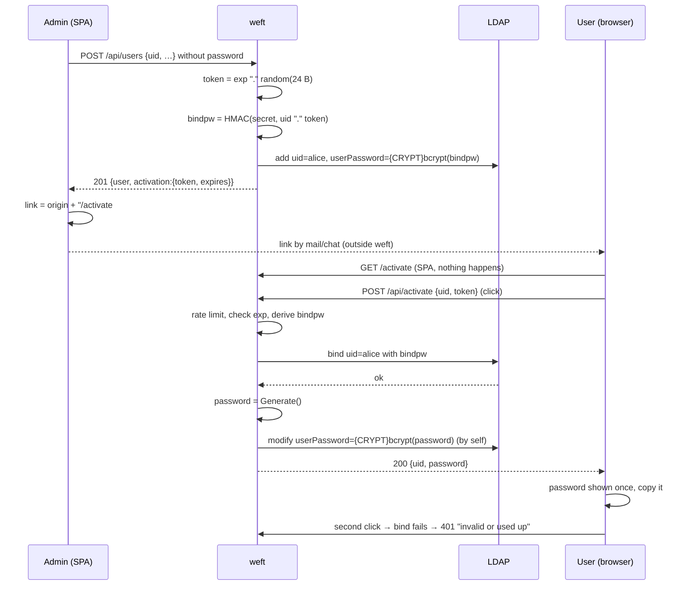

# Concept: generator-format passwords and activation links

Status: 2026-10-09, based on weft 0.5.0. Draft. The password format from
part 1 has been implemented in the frontend since 0.4.0; the activation link
has not. Second revision: the link is no longer a bind password (see "Why a
secret is needed").

## Goal

1. Every password weft generates uses the format of
   `password-generator -wd -l 12` (sister project `~/src/password-generator`):
   12 characters, lowercase letters and digits only, in blocks of four
   separated by `.`, e.g. `k3pa.7xmq.e2tn`. Since 0.4.0, "Vorschlagen" and the
   import produce such passwords (`web/src/lib/password-gen.js`); what is
   missing is server-side generation for activation.
2. Creating a user no longer assigns a password. Instead the user gets an
   **activation link**. Opening it makes weft generate a password, show it to
   them once, and the link is used up.
3. **The link cannot be used to log in anywhere**: not to weft, not to
   Synapse, not to any other service that binds against the directory. Only
   the password from the activation is a login.
4. weft keeps **no state** for this: no token table, no file. The directory
   is the only store, and weft still needs no service account. The price is a
   single static value in the configuration, `activation_secret`.

## Core idea

When creating the user, weft writes to `userPassword` the bcrypt hash of a
**derived** value:

```
bindpw = base64url( HMAC-SHA256( activation_secret, uid || "." || token ) )
userPassword = {CRYPT} bcrypt( bindpw )
```

The link carries only `token`. Whoever has the link does not know `bindpw`,
because they lack `activation_secret`. A bind with the token fails
everywhere, with Synapse as with weft's own login. Only `/api/activate`
derives `bindpw`, binds with it *as the user themselves*, replaces
`userPassword` with the hash of a fresh password through the `by self` write
rule weft already requires, and shows that password once. Afterwards `bindpw`
exists nowhere; the link is dead. weft does not have to remember anything.

### Why a secret is needed

The first revision stored bcrypt(token) directly. That made the link a valid
initial password for every service that binds against the directory. This
cannot be solved in the directory:

- ldapd has no filter ACLs and no password policy; there is no "refuse the
  bind while attribute X is set". OpenLDAP could do it (ppolicy
  `pwdAccountLockedTime`), but the lock would also hit weft's activation
  bind.
- A separate subtree `ou=pending` outside the other services' search base
  fails because the user cannot move their entry to `ou=people` during
  activation (no add right there, and ldapd has no ModifyDN either).
- Putting the token in another attribute and leaving `userPassword` empty
  does not help: then nobody can bind during activation to write the
  password.

So the separation between "has the link" and "can bind" has to come from
knowledge only weft has. An HMAC key is the smallest such knowledge. It is
configuration like `bcrypt_cost`, not runtime state: nothing grows, nothing
needs backing up or cleaning up, and several weft instances with the same key
behave identically.

Side effect: the expiry time becomes effective. In the first revision an
expired link remained a valid password in the directory. Now nobody can bind
after `exp`, because weft refuses the derivation and nobody else knows it.

## Part 1: password format

### What is adopted

From the generator's `password.rs`, mode `-wd -l 12`; implemented this way in
0.4.0:

| Property | Value |
|---|---|
| Lowercase letters | `abcdefghijkmnpqrstuvwx` (without `l`, `o`, `y`, `z`) |
| Digits | `0123456789` |
| Length | 12 characters without separators, 14 with |
| Presentation | blocks of four, separated by `.` |
| Guarantee | at least one lowercase letter and at least one digit, positions shuffled |
| Entropy | pool of 32, 60 bits (ample behind bcrypt) |

The generator's reasoning applies unchanged: no easily confused characters,
types the same on QWERTZ and QWERTY, no quoting pitfalls. The password is easy
to type and fits into a phone call.

### Where it is generated: once, in Go

Since 0.4.0 the algorithm runs in the browser (`web/src/lib/password-gen.js`
with `crypto.getRandomValues`, tests in `password-gen.test.js`). For
activation, however, the password has to be created on the server. So it is
ported to `internal/password` (`Generate() string`, about 30 lines plus tests:
alphabet, block layout, mandatory characters, distribution) and replaces the
JavaScript version as the only implementation. It is needed

- for activation (server-side, mandatory),
- for the "Vorschlagen" buttons in the admin UI (reset password, password on
  creation, uniform test-user password) through a small admin endpoint
  `GET /api/password/suggest` → `{ "password": "…" }`,
- in the import for rows that want a generated password instead of a link
  (see test users below).

`passphrase.js` and `passphrase-data.js` (about 200 KB of word lists) have
been removed since 0.4.0. With the Go port, `password-gen.js` goes too.

Rejected: calling a running `password-generator serve` over HTTP. In the
sandbox model the weft worker has no network access apart from the LDAP
descriptors the monitor hands it. A second service would be a runtime
dependency for the core function, and a password would travel over the
network. The port costs less than the integration.

## Part 2: activation link

### Flow



### Token and derivation

```
token   = <exp>.<rand>          e.g.  1758536400.Kx7QmZ…(32 characters)
exp     = Unix seconds, decimal
rand    = 24 bytes from crypto/rand, base64url without padding (192 bits)
bindpw  = base64url( HMAC-SHA256( activation_secret, uid "." token ) )   43 characters
link    = https://<origin>/activate#uid=<uid>&token=<token>
```

- **`bindpw` is the entry's only bind password**, and it is never written
  down anywhere: not in the link, not in a mail, not in a log. weft computes
  it on creation (to hash it) and on activation (to bind with it) and throws
  it away.
- `uid` is part of the derivation, so a token only works for the entry it was
  issued for.
- `exp` enters the derivation through the token. Changing `exp` in the link
  changes `bindpw`, and the bind fails. The expiry is therefore tamper-proof
  even though the directory does not know it.
- 43 characters, well below bcrypt's 72-byte limit.
- `uid` and token sit in the **fragment** (`#…`), not in the path or query.
  Browsers do not send the fragment, so the token ends up neither in weft's
  access log nor in the relayd/nginx log nor in a referer. The SPA reads it
  from `location.hash` and sends it in a POST body.
- The SPA builds the link from `window.location.origin`. weft needs no
  `public_url` option, because the admin already opened the page under the
  public address. If they open it under an internal hostname, the links are
  internal; that belongs in the docs, an option can follow later.

### Why GET does nothing

Mail scanners, chat previews and link checkers fetch URLs as soon as they are
delivered. If activation happened when the page loads, the link would be used
up and the password shown to a bot before the human sees it. Hence: the page
shows "Activate account *alice*" and a button; only the click sends the POST.
The fragment never reaches the server anyway, so a preview fetch cannot
trigger anything.

### Becoming invalid

The link is valid exactly when weft derives a `bindpw` from it that binds. It
becomes invalid through

- the activation itself (`userPassword` is then the hash of the new
  password),
- "regenerate activation link" by the admin (new token, old link dead),
- "set password" by the admin,
- deleting the user,
- expiry of `exp`: weft refuses the derivation, and without the derivation
  nobody can bind,
- changing `activation_secret`: all open links die, and the admin
  regenerates them.

### Server

New and changed endpoints:

| Endpoint | Who | What |
|---|---|---|
| `POST /api/activate` | public, rate-limited per IP | `{uid, token}` → `{uid, password}`; 401 if invalid/used up/unknown, 410 if expired |
| `POST /api/users` | admin | `password` becomes optional; without `password` the creation answers with `activation: {token, expires}` |
| `POST /api/users/import` | admin | per row as above; the result carries `activation` or `password` (with `generatePassword: true`) |
| `POST /api/users/{uid}/activation` | admin | new token for an existing user, **overwrites** the password; answer `{token, expires}` |
| `GET /api/password/suggest` | admin | one password in generator format |
| `GET /api/meta` | logged in | additionally `activationEnabled` and `activationLinkTtlSeconds` |

Flow in `handleActivate`:

1. Rate limit per client IP as for login (separate limiter, so activation
   attempts do not use up the login quota). The client IP is determined the
   same way, so behind a reverse proxy it depends on `trusted_proxies`
   (since 0.5.0).
2. Parse the token; `exp` in the past → 410, without a bind. Since `exp`
   comes from the token itself, this reveals nothing about the user.
3. Derive `bindpw`, `dir.BindUser(uid, bindpw)`. `ErrInvalidCredentials` →
   401 with the same message for an unknown uid, a wrong token and a used-up
   link.
4. `password.Generate()`, hash, `c.SetPassword(uid, hash)` on the same
   connection. That is the `by self` write access to `userPassword` weft
   already requires.
5. Answer with the plaintext password. Log: `activation: uid=alice`, never
   the token, `bindpw` or password.

Concurrent double clicks: the SPA disables the button after the first click;
server-side a single-flight per uid (short-lived in-process mutex map, no
persistent state), so two activations do not write two passwords of which
only the last one counts.

The endpoint ignores the session cookie and CSRF header: it is deliberately
usable without a session, the token is the proof. It also works with
`allow_admin = false`, because it is pure self-service.

In the service layer:

- `IssueActivation(ctx, c, uid) (token string, expires time.Time, err error)`:
  build the token, derive `bindpw`, hash, `c.SetPassword`. Used by
  `CreateUser` (without a password), by the import and by the reissue
  endpoint.
- `Activate(ctx, dir, uid, token) (password string, err error)`: steps 2 to
  4 above.
- Derivation and token format in a small file `activation.go` with tests
  (determinism, uid binding, exp tampering, length).

### Configuration

| Option | Default | Env | Meaning |
|---|---|---|---|
| `activation_secret` | empty (feature off) | `WEFT_ACTIVATION_SECRET` | HMAC key of the derivation, at least 32 characters |
| `activation_link_ttl` | `168h` (7 days) | `WEFT_ACTIVATION_LINK_TTL` | validity of a link from creation |

About the key:

- Generate it with `openssl rand -base64 32` or `password-generator -l 32
  --no-separator`. weft rejects shorter values at startup.
- Without a key the feature is off: creating a user requires a password as
  before, `/api/activate` and the reissue endpoint answer 404, and the UI
  hides the link option (`activationEnabled` in `/api/meta`). A line in the
  startup log says which mode is active.
- Changing the key kills all links not yet redeemed. That is intended and the
  only way to invalidate all open links at once. Activated accounts are not
  affected; their password does not depend on the key.
- Like the rest of the configuration, the value is read before chroot and
  privilege drop; the worker receives it through the re-exec'd environment
  like everything else. `/etc/weft.toml` is `root:wheel 0600` anyway.
- Several weft instances in front of the same directory need the same key,
  otherwise only the issuing instance can redeem a link.

### Frontend

- `App.svelte`: if `location.pathname === "/activate"`, `Activate.svelte` is
  rendered before login and session (the SPA fallback serves `index.html` for
  every path, no router needed). The page reads `uid` and `token` from the
  fragment, shows the account and a button, and after success the password
  large and monospaced with a copy button, the note "will not be shown
  again" and the link to the login. A note that the password can be changed
  after logging in points to the existing self-service.
- `UserEditor.svelte`: choice between "create activation link (default)" and
  "set password". After creation a dialog with the link, expiry date and a
  copy button.
- `UserDetail.svelte`: action "regenerate activation link" with a
  confirmation ("the current password becomes invalid"). Covers forgotten
  passwords and expired links.
- `ResetPassword.svelte`: "Vorschlagen" calls `/api/password/suggest`.
- `ImportUsers.svelte`: the password column becomes optional. Rows without a
  password get a link. Instead of `weft-passwoerter.csv` there is
  `weft-aktivierungslinks.csv` with `uid,link,expires`; rows with a password
  from the file stay as today. The test-user generator keeps its uniform
  password and, without one, generates passwords (`generatePassword: true`
  per row, the server returns them in the result), because 200 activation
  links for load-test accounts help nobody.

### Security

- **The link is not a password.** A bind with the token fails at every
  service, including weft's login. The only way from the link to the account
  goes through `/api/activate`, and that ends with a fresh password only the
  user sees. The admin never knows the final password.
- An account before activation is effectively locked: nobody knows its only
  bind password; weft computes it only at the moment of activation.
- 192 bits of randomness in the token, HMAC-SHA256 in the derivation, only a
  bcrypt hash in the directory. Online guessing is limited by the rate limit
  on `/api/activate` and the bcrypt cost of the bind.
- **Expiry is effective.** After `exp` weft refuses the derivation, and
  without the derivation nothing binds. The entry remains a dead account
  until reissue or deletion; stage 2 makes such accounts visible in the list.
- No user enumeration: an unknown uid and a wrong token answer the same; the
  expiry check needs no directory access.
- Token only in the fragment and the POST body, never in a log. `bindpw`
  never leaves the process.
- **No new ACL** for stage 1: `by self` write on `userPassword` has been a
  weft requirement since 0.1.
- Threat model for the key: whoever has `activation_secret` *and* an open
  link can activate the account, nothing more. Whoever can read weft's
  configuration already sees the LDAP connection; the key adds no new class
  of access.
- No runtime state, so nothing to back up and nothing that can get lost on a
  restart.

### Stage 2 (optional): making pending activations visible

Without an addition, weft cannot tell which users have not activated yet.
After importing 30 people, though, that is the first question. Proposal: a
marker in the entry itself.

- Option `activation_marker_attr`, default empty (off), e.g. `description`.
  An attribute the entry's object classes already allow.
- When issuing a link, the admin writes the value
  `weft-activation:<expires RFC 3339>`. "Set password" removes it.
- On activation **the user themselves** removes the value on the same
  connection. That needs a second `by self` write rule for this attribute
  (ldapd: `allow write access to subtree "ou=people,…" attribute description
  by self`; OpenLDAP correspondingly in `olcAccess`). If removing it fails,
  the activation still succeeds and weft logs a warning.
- The user list shows "activation pending until …" or "link expired" and
  offers a filter; the reissue button sits right next to it.

Because the marker is display only and requires an ACL change, it is opt-in.
Stage 1 works completely without it.

## Rejected alternatives

| Alternative | Why not |
|---|---|
| bcrypt(token) directly in `userPassword` (first revision) | the link is then a bind password for Synapse and every other LDAP service |
| lock the bind in the directory (ppolicy, filter ACL, separate subtree) | ldapd cannot do it; where it is possible, it also locks weft's activation bind or fails on the missing move |
| token hash in a separate attribute, `userPassword` empty | during activation nobody can bind to write the password |
| HMAC-signed token without an entry in the directory | also needs a key, but additionally a service account to write: weft has none |
| token table in weft (file, SQLite) | runtime state; breaks the sandbox (`/var/empty`) |
| weft sends the mail itself | SMTP configuration, network access for the worker, templates; the admin sends links the way they send passwords today |
| password-generator over HTTP | see part 1 |

## Implementation

1. `internal/password`: `Generate()` + tests.
2. `internal/service`: `activation.go` (token format, derivation),
   `IssueActivation`, `Activate`; `CreateUser` without a password. Tests
   against the Fake, which checks binds against the stored bcrypt hash and
   models `by self`. That makes the whole path testable: create without a
   password → login with the raw token fails → activate → login with the
   returned password → second activation fails → an expired token is rejected
   without a bind → a tampered `exp` does not bind → a different key does not
   bind.
3. `internal/config`: `activation_secret` (length check), `activation_link_ttl`.
4. `internal/server`: routes, handlers, limiter, DTOs, single-flight,
   `activationEnabled` in `/meta`; HTTP tests.
5. `web`: `Activate.svelte`, changes in editor, detail, reset, import;
   replace `password-gen.js` and its test with `/api/password/suggest`.
   (The passphrase modules and their i18n strings have been removed since
   0.4.0.)
6. Docs: README (options, API sketch, security section), `weft.toml.example`
   with a commented-out `activation_secret` and the command to generate it,
   `compose.yml.example` with `WEFT_ACTIVATION_SECRET`, the Helm chart with
   the key taken from an existing Secret (not a plain value), CHANGELOG
   0.6.0.
7. Afterwards, separately: stage 2 with the marker, ACL examples in
   `contrib/`.

Rough size: about 350 lines of Go plus tests, about 400 lines of Svelte (the
200 KB of word lists already left the bundle with 0.4.0). `-dev` with the
Fake covers the complete flow (with a fixed dev key there, so no setup is
needed); no LDAP server is required for development.

## Assumptions made

- The generator is ported, not integrated.
- A static key in the configuration is acceptable; it is the minimal price
  for the link not being a password.
- The password is generated at activation; the user does not choose one. They
  can change it afterwards in the self-service.
- Links are valid for 7 days.
- Test users keep getting passwords, not links.
- Stage 2 comes later.
